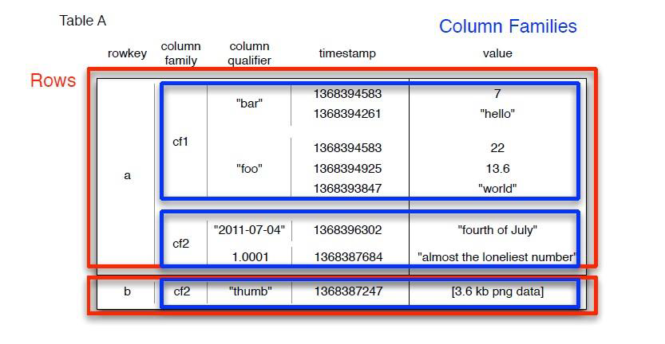
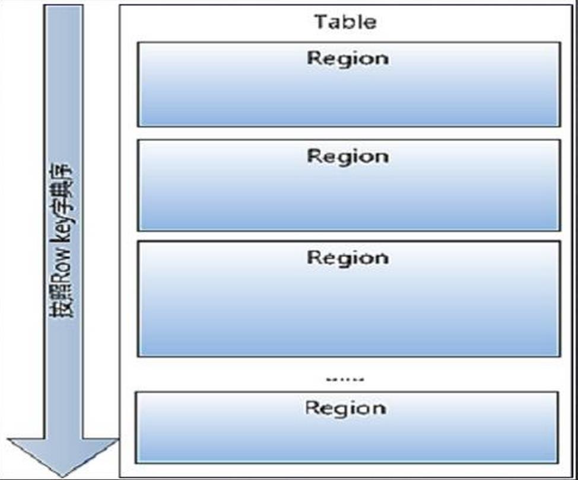
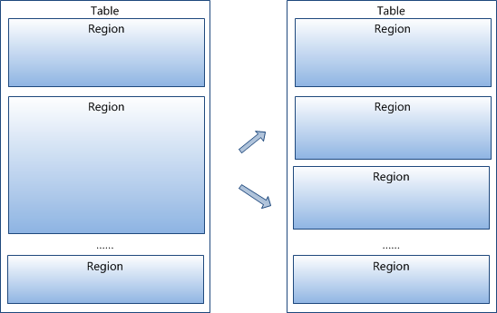
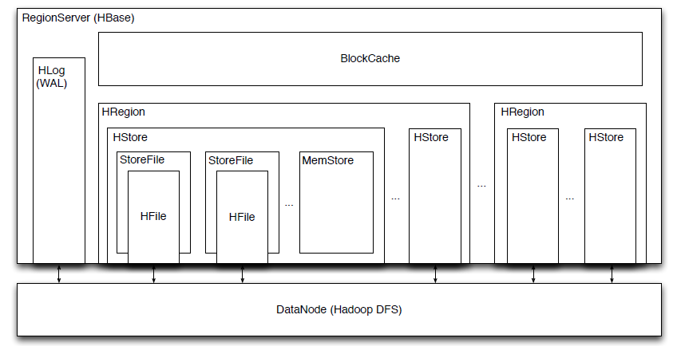

数据库的数据存储分为

* 行存储：关系型数据库，优点是可以一次性写入一条记录，同时进行检查，数据完整。缺点是读取数据时有冗余数据，读取速度慢

* 列存储：非关系型数据库，优点是读取时没有冗余数据，适合大数据的读取。缺点是写入效率差，数据完整性不能保证

hbase是非关系型分布式数据库（NOSQL），数据大部分存储在HDFS上，少部分在内存里，适合海量稀疏存储

**hbase优点**

* 在HDFS上随机访问数据会影响读取效率，但hbase有部分数据存储在内存里，所以适合随机访问

* 存储海量数据

* 进行大量的改写

 ## hbase的数据模型

* RowKey：是每条记录的主键，采用Byte Array排序，如001，002

* Column Family：列簇，包含一个或多个列

* Column：Column qualifier，属于某个column family的某一列，写成：column family:column

* Version Number：类型为 Long ，默认值是系统时间戳，可由用户自定义。对数据更改时，会复制原数据记录再更新，原数据不会删除，做了一个如时间戳的标记，就是Version Number

* Value：存储的值

 ### hbase数据的排序

数据的检索顺序：

rowkey:column family:column qualifier:version number:value

数据是三维有序的：

存储时，rowkey，column family，version number都是排序的。排序时，version number大的应该排在前，因为时间戳越大，数据越新

*除了value都可以理解为key*



## hbase的物理模型

* region：多条记录的集合。hbase是由一个或多个region组成的，region内部和region之间都是按rowkey排序



region 按大小分割，里面的记录按key分区排序。每个表一开始只有一个 region ，随着数据不断插入表， region 不断增大，当增大到一个阀值的时候， region 就会等分为两个新的region 。当 table 中的行不断增多，就会有越来越多的region



有些region的访问请求少，负载不均衡，可以进行合并

**region的合并**

*minor compaction*：把小文件快速合并成大文件，但是合并的不彻底，有冗余的数据

*major compaction*：彻底的合并，把无效的，重复的数据都删除

region的分裂、合并不应太多也不应太少

太多：给zk增加负担，造成读写性能下降

太少：降低读写并发能力，导致压力不够分散

*通常不允许系统自动切分，切分时会影响数据访问，空闲时候再做手动切分；合并一般手动完成*


* region server：代表节点，region是由region server管理的，一个region只能由一个server管理，一个server可以管理多个region，region server管理region的IO。region server存储的多个region不一定来自同一个table，一个table中的region不一定来自一个region server

HRegion是Hbase**分布式存储和负载均衡的最小单元**，但不是存储的最小单元，是逻辑意义上的概念，region是物理意义上的

Hregionserver代表进程，负责响应用户的IO请求，与HDFS进行交互。管理多个HRegion，HRegion包含多HStore，HStore对应着Table的ColumnFamily，包括memstore（内存中） + storeFiles/HFile（HDFS）。 数据先存储在memstore，达到一定阈值后溢写入storeFiles

### 读数据

* 内存
  * block cache：读缓存，和region server对应
  *  memstore：读、写缓存，和region对应，memstore和block store有上下级的管理关系

* hdfs

**Hlog**：日志机制，避免数据丢失。一个region server上的所有region共享hlog

#### 预写日志（WAL/write ahead log）

是存储在hdfs上的所有节点共同维护的一个日志，在每个region server进行操作时都会把操作写入这个log日志，一旦region server失效，其他的节点就可以读取这个日志重复操作以恢复数据。客户端在向region server提交数据时只有同时向WAL写入成功，才会被告知提交成功



## hbase的系统架构

* client：接口，访问hbase

* master：分配region归属于哪一个region server，起负载均衡的作用，管理table元数据，ACL权限控制

* region server：管理本地的region的IO，读写HDFS，维护table

* zookeeper：
  * 保证集群中只有一个master
  * 寻址，存储所有 Region 的入口（ ROOT ）地址
  * 实时监控（心跳） Region Server 的上下线信息，并通知 master

**寻址**：client发出请求，比如读取表，需要获取表存储在哪一个机器上，这个过程就叫寻址

寻址方式

* client缓存

* zookeeper
  * zookeeper寻找Hregion server的位置，也就是meta表的位置
  * 从meta表获取Hregion位置
  * 读取row-column

### 容错机制

* region server节点通过心跳告知master自身的状态，一旦没有心跳master会重新分配region，并把数据预写到其他节点

* zookeeper存储一定的元数据和备份信息

* master出现问题，zookeeper会重新选择一个master，无master过程中，数据可以照常读取，但region切分无法执行

## hbsae表格设计

* rowkey可以倒序存储

如果rowkey是ip，手机号，前几位反应的是城市，热门城市容易被访问，如果按正序排列，负载不均衡，所以倒序存储，打乱分区

比如192.168.0.1 - 1.0.861.291

* 通过hash（md5、crc32）进行加密
* rowkey的长度越短越好，尽量不要超过16个字节
* rowkey独一无二
* column family个数不要太多，1~2个。当某个cf的数据flush的时候，其他cf也会关联被触发flush，所以如果cf比较多，一旦出现连锁反应，会导致系统产生大量IO

 *flush：从内存写出*

**hbase启动**

主节点的bin下：

```shell
start-hbase.sh
```


