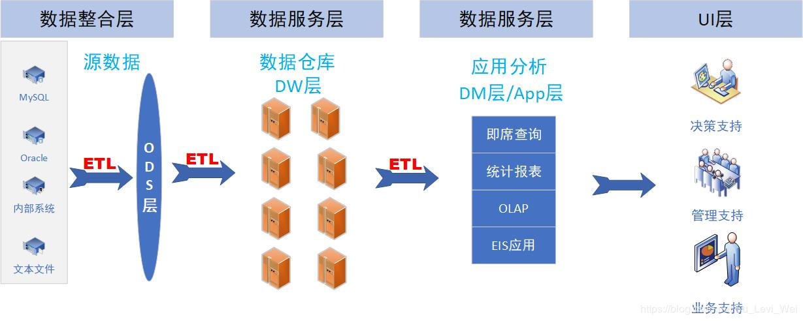
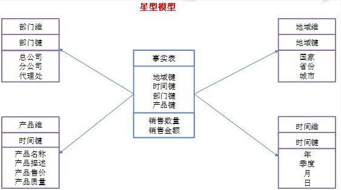
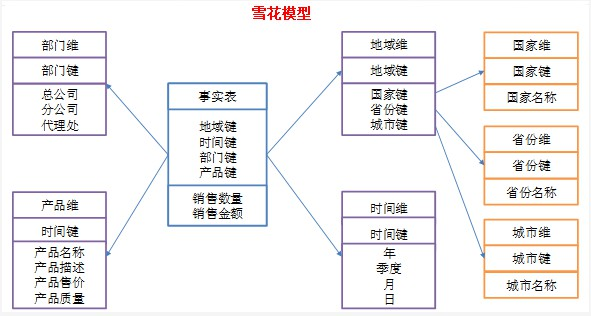
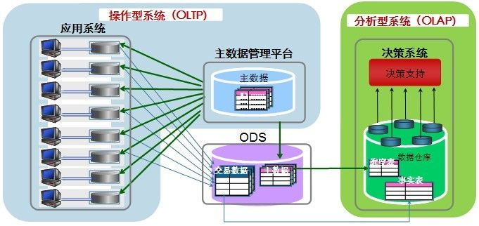

## CAP

CAP理论包含三个部分：一致性，可用性和分区容忍性

### consistency

一致性，是指所有节点在同一时间获得的数据是一致的，分为强一致性和弱一致性

* 强一致性：数据更新之后，后续的访问能够立即看到更新值。也就是说，任一时间不同节点访问的结果是一样的
* 弱一致性：数据更新后，后续的访问不能看到部分/全部的更新值。也就是说，任一时间不同节点访问结果不一致。大部分的分布式数据库会采用**最终一致性**的方法，即经过一段时间后所有节点访问的数据都是一致的

### availability

可用性，是指不管请求失败还是成功都能得到响应

### partition tolerance

分区容忍性，是指丢失了系统任意的信息都不会影响系统运行

对于分布式数据库来说，最多只能满足其中两个条件。分区容忍性必须满足，否则这个分布式就没有任何意义。故分布式数据库就是要在一致性和可用性之间做一个取舍。对于分布式数据库，强一致性的意义没有那么大，所以可以保证可用性，只要达到最终一致性即可，一般是用异步复制来实现高可用和最终一致

## 数据仓库

data warehouse，简称数仓，数据一般来源于数据库和文件。数据存储在数仓中，供分析使用以提供决策支持和业务优化

数仓出现的原因：

传统的数据库是为了业务而存在的，比如需要查看当月的销售额，那就在数据库建一个表，这个表是二维的，字段是业务需要的；若想要查看当年的销售额，又需要重新建一个表，重新建立表关系。为了更好地对某个主题做查询分析，数仓应运而生。数仓是把数据库的多个表做连接储存起来，数据规模更大，从逻辑上讲和数据库没有太大差别。数仓不需要多快的写入速度，只需要复杂查询的速度足够快就可以了，是用空间换取了时间

和数据库差别：

* 数据库是面向应用的，用来做操作型的事务处理（OLTP），经常更新；数仓是面向主题的，用来做分析处理（OLAP），数据不可更新
* 数据库的数据一般是实时的，对时间敏感；数仓是历史数据，对时间不敏感
* 数据库存储的数据量小，单次作用的数据量也小；数仓存储的数据量大，单次作用的数据量也大
* 数据库的冗余数据少，存储结构紧凑；数仓冗余数据多，存储结构分散
* 数据库读写都有优化（针对小批量数据），数据模型一般是三范式，有助于插入；数仓只对读有优化，数据模型是星型/雪花型的，有助于查询
  * 数仓的读优化：根据partition key和primary key进行扫描，同时可以并行查询。但是在读取小批量数据和没有使用partition key（全表扫描）的情况下，数据库的读取效率可能更高

### 特点

* 面向主题：区别于数据库面向业务/应用，数仓是做分析处理的，数据要保证完整性和一致性
* 数据集成：数据来源于很多数据库或文件，要对数据做清洗和转换等处理
* 不可更新：数仓中的数据多是历史数据，不追求数据的实时性，不对数据进行更新修改，多是查询
* 数据随时间增加：这里的数据增加是指数据量的增加，和不可更新并不矛盾。当数据存储到达一定年限也会被删除，很多查询分析也和时间有关，所以数据一般有时间项

**数据湖：**存储数据的一种方式，不同于数仓，存储的是原始数据，没有严格的结构，可以是结构化的也可以是非结构化的，直到查询前才会确定最终的结构，所以查询花费的时间更多，管理起来也更麻烦

### 架构

四层：

* ODS：operation data storage，操作型数据存储，也称为临时存储层，是接口数据的临时存储区域，和源数据（来源于数据库和文件）是同构的
* DW：数据仓库层，存储清洗后的数据，数据模型遵从第三范式，粒度和ODS一致。这一层数据的要求是满足一致性和准确性
* DM：数据集市层，对DW层的数据进行了轻度的聚合，通常是星型/雪花型的数据，数据从广度上说覆盖了DW
* APP层：应用层，为了分析而存在的，数据是高度聚合的，也是星型/雪花型，从广度上说，数据没有覆盖DM，是其的一个真子集

**数据集市：**数据的较小子集，更易于管理维护，可以看作是小型的数仓

为什么分层：

* 如果业务发生了变化，整个数据清洗的流程就要变化，分层可以减少清洗的工作量
* 把原本复杂的过程分解为更小的过程
* 如果出错了，分层也有助于查找错误和调整
* 不同阶段的数据需要不同的数据模型

### 元数据

分为两种：

* 技术元数据：数仓的开发、管理和维护相关，包括数据的转换、映射、权限管理等
* 业务元数据：和业务相关，比如业务术语、数据可用性等

有两种存储方法：

* 以数据集为基础，每个数据集文件都有对应的元数据文件
* 以数据库为基础，元数据库只有一个元数据文件

### 数据模型

**定义：**

数据关系的一种映射，将模糊的关系模拟和抽象出来

**建模原因：**

* 建立数据间的联系，保证数据的一致性和完整性
* 分离技术和业务，通过两者的解耦，上层的业务的变化，底层技术也可以灵活改变，适应性更强

**阶段划分：**

* 业务建模：由用户的需求提炼出来的用以描述业务的一些概念的东西 
* 领域建模：由行业内的各个企业的业务模型再向上抽象出整个行业的业务模型，描述的是业务中涉及到的实体及其相互之间的关系，它是需求分析的产物，与问题域相关 
* 逻辑建模：将上述提到的概念具体化，将实际的需求再细分，依然属于分析需求的步骤
* 物理建模：将逻辑建模提出的需求在物理介质上实现，比如建表

总的来说，数据建模就是一个从业务抽象出概念--将概念具象并细分需求-物理实现需求的过程

#### 范式建模法

范式是逻辑模型设计的基本理论，一个关系模型可以从第一范式到第五范式无损分解，这个过程称为规范化

大部分的范式建模都采用第三范式（Third Normal Form或3NF），以关系型数据库为基础，结合业务的数据模型，是一种从上而下的建模方法

* 1NF：原子性，即每列的数据都必须是不可拆分的最小单元，不能是集合、数组等。若某列有多个属性值必须拆成多列
* 2NF：唯一性，每列数据都必须依赖主键，即一个表只会描述一件事情
* 3NF：每列都必须直接函数依赖于主键，不能传递函数依赖

*依赖：B数据可以由A数据确定，就称B完全函数依赖于A，类似于y=f(x)的映射关系；B数据不能由C数据确定，就称B部分函数依赖于A和C，类似于z=f(x,y)，y是常数或者无关的变量；B依赖于C，C依赖于A，则B间接依赖于A，称为传递函数依赖，类似于z=f(y)，y=f(x)*

*码：候选码，简称为码。若某个/某几个字段可以完全确定这个记录，即其他的字段完全函数依赖于它，那么这个/几个字段称之为码，码可以有多个。码中的字段称为主属性*

范式建模法保证了数据的一致性，没有冗余数据；但是基于关系型数据库建模，灵活性不够

#### 实体建模法

entity modeling，将业务的每一个组成部分抽象为实体、关系和属性。 实体，指发生业务关系的对象；关系，主要指实体间的业务过程；属性，主要是针对实体和关系的特殊说明，用E-R图表示。实体建模法只能局限在业务建模和领域建模的阶段

#### 维度建模法

##### 事实表和维度表

**事实表**

fact table，是指存储事实记录的表，比如日志，记录数一般是动态增长的

**维度表**

dimension table，也叫查找表，lookup table，存储的是从事实表抽离的重复的常用的数据，一般变化不大

维度和度量（指标）是两个常用的概念，前者是指分析问题的角度，一般是离散值；后者是从这个角度得到的估计/计算值，一般是连续值

好处：

* 维度表减小了事实表的规模，使得增删改查更方便
* 可以复用给多个事实表

使用事实表和维度表建模（称为维度建模法dimension modeling），需要对数据做大量的预处理和预计算，有冗余数据；当维度变化时，需要重新计算；优势在于，数据经过大量预处理可以直接使用，加快了复杂查询的速度

##### 星型和雪花型模型

* 星型：star-schema，所有的维度表都直接关联到事实表上，维度表之间没有连接，没有渐变维度，存在冗余数据。数据是反规范化的，可用实现高度的并行化

*反规范化：以增加冗余数据为代价，牺牲写入性能，提高读取性能*

* 雪花型：snowflake-schema，将部分维度表（主维度表）分成了更细粒度的维度表，细粒度的维度表通过主维度表连接到了事实表上，这些维度表使得存储数据量尽可能小，改善了数据冗余的问题，同时查询也需要连接多个表一起，数据是规范化的，不适合高并行

星型虽然有冗余，但是不需要做连接，所以星型的查询效率一般更高，用的也更多

在业务建模和领域建模阶段，一般使用实体建模法，在逻辑建模和物理建模阶段，一般使用三范式和维度建模法

## OLTP和OLAP

OLTP（online-transaction processing）是指在线事务处理/操作型处理，主要面向数据库，面向日常的事务，强调数据的实时查询（小批量的读取）和更新，在意的是并发能力，稳定性，执行的内存效率；OLAP（online-analytical processing）是指在线分析处理/分析型处理，主要面向的是数据仓库，在意分区和并行。常用来对历史数据做处理分析，将复杂分散的数据整合在一起，形成更简单直观的数据查询，给决策支持

可以理解为，OLAP是由OLTP发展而来的，因为OLAP分析的数据都是由OLTP的数据累积而成的

|            |             OLTP             |               OLAP               |
| :--------: | :--------------------------: | :------------------------------: |
| 面向使用者 |           业务人员           |              管理层              |
|    功能    |         日常操作处理         |             决策支持             |
|    设计    |           面向应用           |             面向主题             |
|  工作单位  |          简单的事务          |            复杂的查询            |
|   数据量   |           数据量小           |             数据量大             |
|  时间要求  |           实时查询           |           数据可以延迟           |
|    数据    | 二维的，当前的，可更新的数据 | 多维的，历史的，只读可追加的数据 |
|    应用    |            数据库            |             数据仓库             |
|  衡量指标  |          事务吞吐量          |           查询响应速度           |
|  设计模型  |      3NF或实体-关系模型      |           星型或雪花型           |

OLAP可分为ROLAP（关系型OLAP）、MOLAP（多维OLAP）和HOLAP（混合型OLAP）

## ETL

指对数据的提取，转换和加载，实现一般有三种方法：

* ETL工具，简单方便，效率高，但灵活性不高
* SQL，灵活性高，但对技术有要求，开发效率不高
* ETL工具加SQL，综合了两者的优缺点

### extract

数据的提取，一般是从各个数据库或者文件提取，在这个过程中也可以进行简单的数据清洗，提取之后数据一般存放在ODS

### transform

数据的清洗和转换，清洗后的数据一般放在ODS里，转换后数据一般存放在DW里

* 清洗：过滤脏数据、不完整数据和重复数据

* 转换：数据类型转换（统一数据类型）、数据粒度转换（数据聚合）和按指标的计算

### load

数据加载，转换后存放在DW里

ETL完成的是数据从数据源（来源于数据库或者文件）到数仓/数仓到数据集市的迁移

### 日志文件

ETL的日志文件分为三类：

* 执行过程日志：记录ETL的执行过程
* 错误日志：记录ETL的错误信息
* 总体日志：记录ETL开始和结束的时间以及是否成功