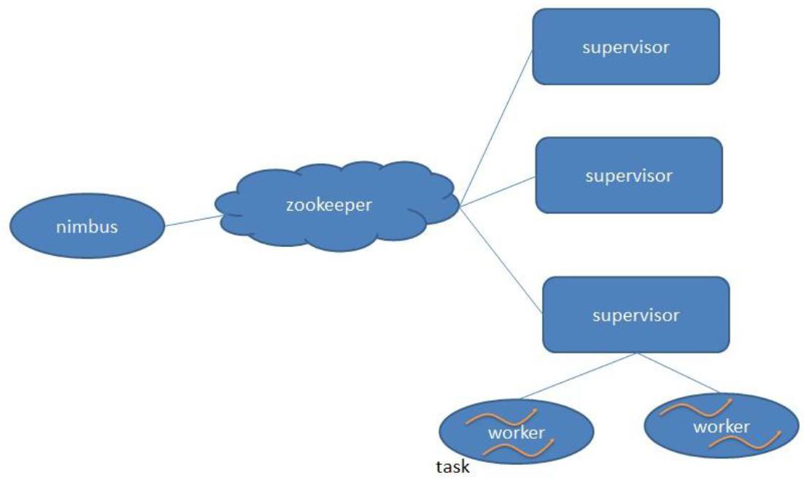
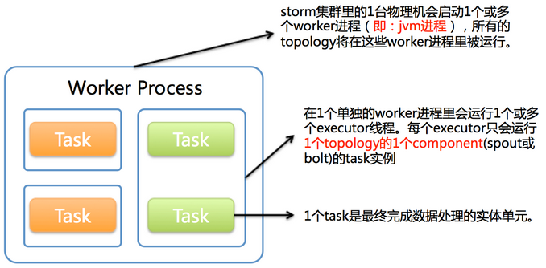
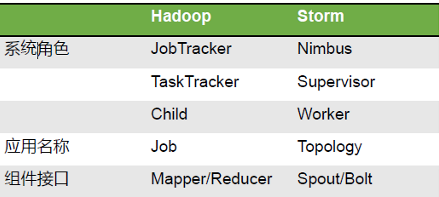
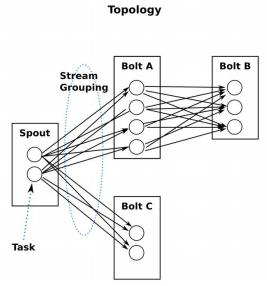
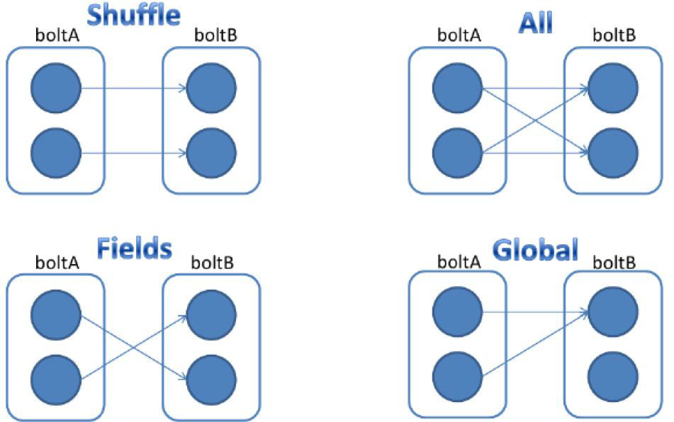

storm是一个开源实时计算框架，支持多种编程语言，存在一个本地模式，用于测试代码。和MapReduce对比，storm面向实时处理，MapReduce面向批量

两者比较：

* Mapreduce

优点：多进程，稳定、吞吐能力强

缺点：时效性差

* Storm

优点：时效性强，毫秒级别，没有持久化层，计算更快

缺点：增量式处理（来一个数据处理一个），没有结束状态，除非手动杀死进程。多线程，一个线程出错整个进程结束

*持久化：把数据从内存写入磁盘存储。storm的数据在内存中流转，不在磁盘中落地，省去了大量批处理的时间，所以延时低，但吞吐能力也低*

**storm的可靠性保证**

无论数据是否得到处理都会反馈，若没有处理，重新发送数据（ack机制）

## storm架构



* Nimbus

  主节点，负责资源分配，任务调度和监控，类似Hadoop里的 JobTracker，负责在集群里面分发代码，分配计算任务给Supervisor，并且监控子节点的状态。

* Supervisor

  从节点，负责接收 nimbus 分配的任务。每个工作节点只有一个supervisor，启动和停止自己管理的 worker 进程（每一个工作进程执行一个 Topology 的一个子集，一个 Topology 由运行在很多节点上的不同 worker 工作进程组成），监控自身的worker。

*worker是运行具体处理组件逻辑进程，包括多个executor，一个executor可以执行一个或多个task（可设置），是真正的线程，执行的task就是spout或者bolt，但一个executor每次只运行一个task*



MR和storm架构比较



首先启动Zookeeper才能启动storm，Nimbus 和Supervisor之间的所有协调工作都是通过Zookeeper 集群完成。Nimbus和Supervisor进程都是快速失败（ fail fast ）和无状态的：storm是不存储数据的，状态要么在 Zookeeper 里，要么在本地磁盘上，所以重启Nimbus 和 Supervisor 进程， 任务可以继续提交，就好像什么都没有发生过。storm一旦运行就不会停止，除非kill -9手动结束

## storm计算逻辑

storm的基本数据单元是tuple，stream就是由tuple组成的有向无界的数据流。tuple中包含了各种数据类型，也可以自定义数据类型

### 网络拓扑（topology）

计算逻辑的封装，可以理解为一个job，由spouts和bolts组成的。

storm的原语包括spouts和bolts，由stream grouping连接。所谓原语，类似于MR的map和reduce，每一个原语都是一个线程

Topology的定义是一个Thrift 结构，并且Nimbus就是一个Thrift 服务，可以提交由任何语言创建的 topology

 #### spouts

spouts是消息来源，消息生产者。如果消息没有被成功处理，可重新发送一个 tuple。对接的数据源可以是Hbase、Kafka，可指定发送多个stream流，一个topology只有一个spouts，在开始位置

 #### bolts

bolts是消息处理逻辑，如过滤，访问数据库，数据格式化，聚合。可以发射多个stream流，主方法为 execute：以 tuple 为输入，处理具体的 tuple。一个topology有多个bolts，在中间和结束位置



Stream Grouping定义怎么从一堆 task 发射 tuple 到另外一堆 task。可以调用 TopologyBuilder 类的 setSpout 和 setBolt 来设置并行度，即设置 task的数量。Stream Grouping分为四种

* Shuffle Grouping ：随机分组，负载均衡

* Fields Grouping： 按指定的 field 分组

* All Grouping ：广播分组

* Global Grouping ：全局分组




Topology任务的执行

```shell
Storm jar code.jar MyTopology [arg1 arg2]
```

Topology流程：

以分词为例，第一个spouts对输入的语句进行分词，将分开的单词随机输出给blots，blots将所有单词计数为1，按Stream Grouping分组输出给下一个blots，该blots对单词进行归并计数

## 容错

### 架构容错

* Zookeeper或本地磁盘才存储数据，nimbus和supervisor出错时，直接重启，结果像什么都没发生

* worker和supervisor通过心跳分别告知supervisor和nimbus任务的进度和自身状态

### 数据容错

* timeout：数据传输和处理时间过长，认为超时

* ack机制：保证可靠性，自身也是轻量级线程（特殊task），主要工作是反馈信息，无论数据发送成功/失败，ack都会报告给spout

  ack task的个数如果设置太少会影响性能，如果设置太多会浪费空间

**一个消息经过spout和多个bolt后，如何保证其被成功传输和处理？**

用异或的方法，将每一步spout和bolt产生的数据和下一步输入bolt的数据进行异或，如果上一步输出和下一步输入的数据完全一致，结果就是0，整个过程异或的结果也是0，说明数据被完整传输和正确处理了

监控页面观察：

http://192.168.87.10:8080/index.html
